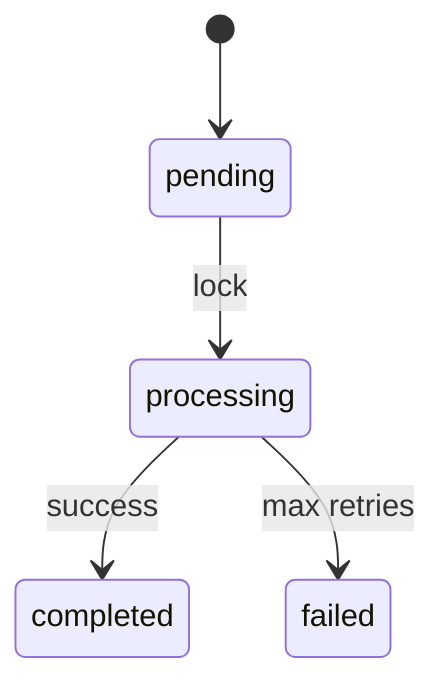

# Documentation Rules

## Style Guide
- Write in clear, concise, professional English.
- Use imperative mood for instructions.
- Use explicit language tags for code blocks (e.g., `typescript`).

## Diagrams
Use Mermaid.js for state diagrams and flowcharts.
Example:

## README Structure
Package READMEs MUST include:
1. **Installation** (`bun add @monque/core`)
2. **Quick Start** (Minimal working example)
3. **API Reference**
4. **Events**

## Spec Documents
Follow the standard spec structure in `specs/`:
- `plan.md` (Implementation Plan)
- `data-model.md` (Entity Definitions)
- `spec.md` (Requirements & Stories)