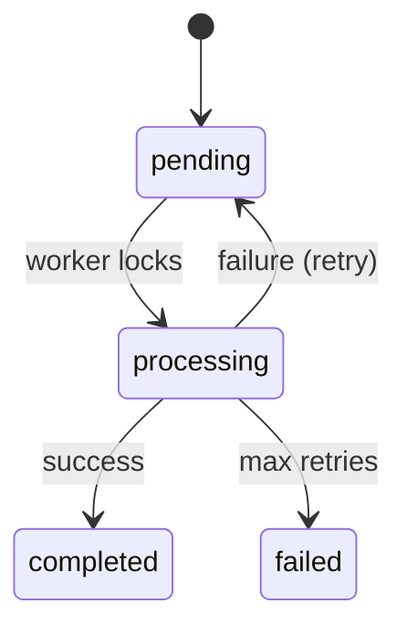

# Documentation Instructions

## Style

- Write in clear, concise, professional English.
- Use headings (`#`, `##`, `###`) to structure content.
- Use bullet points for lists.
- Use code blocks with language tags (e.g., ` ```typescript `).

## Diagrams

Use Mermaid.js for state diagrams and flowcharts:



## README Structure

Package READMEs should include:
1. **Installation** - `bun add @monque/core`
2. **Quick Start** - Minimal working example.
3. **API Reference** - Key methods and options.
4. **Events** - List of emitted events.

## Package Manager

Explicitly mention `bun` as the package manager in documentation where applicable.

```bash
bun install
bun run test
```

## Spec Documents

Follow the existing structure in `specs/`:
- `plan.md` - Implementation plan.
- `data-model.md` - Entity definitions.
- `spec.md` - User stories and acceptance criteria.
