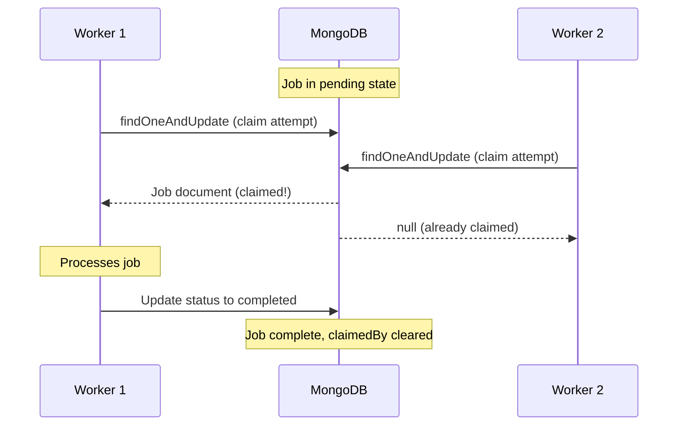

import { Aside } from '@astrojs/starlight/components';

The atomic claim pattern is Monque's core mechanism for ensuring a pending job is claimed by only one scheduler instance at a time.

This prevents **concurrent duplicates**, but it does not guarantee that a job can never run more than once. Jobs may be processed again after a crash, a retry, or stale recovery, so workers should be idempotent.

## The Problem

In distributed systems, multiple workers might try to pick up the same job simultaneously. Without proper coordination, this leads to:

- **Duplicate processing**: Same job runs multiple times
- **Race conditions**: Workers step on each other's work
- **Lost updates**: Results get overwritten
- **Wasted resources**: Redundant computation

## The Solution: Atomic Claims

Monque uses MongoDB's `findOneAndUpdate` with atomic guarantees to ensure only one scheduler claims each pending job.

### How It Works

```typescript
// Simplified internal implementation
const job = await collection.findOneAndUpdate(
  {
    // Only match jobs that are:
    name: workerName,            // For this worker type
    status: 'pending',           // Not already claimed
    nextRunAt: { $lte: now },    // Ready to run
    $or: [                       // Not owned by another instance
      { claimedBy: null },
      { claimedBy: { $exists: false } }
    ]
  },
  {
    $set: {
      status: 'processing',
      claimedBy: schedulerInstanceId,  // Mark ownership
      lockedAt: new Date(),
      lastHeartbeat: new Date(),
      heartbeatInterval: 30000,
      updatedAt: new Date()
    }
  },
  {
    returnDocument: 'after'      // Return the claimed job
  }
);
```

### Why This Works

1. **Atomic operation**: MongoDB guarantees the query and update execute as one unit
2. **First-writer wins**: Only one instance can match and update the same document
3. **Immediate visibility**: Other instances see the updated document instantly
4. **No external locks**: No need for Redis, ZooKeeper, or distributed lock managers

## Scheduler Instance ID

Each Monque instance has a unique identifier:

```typescript
const monque = new Monque(db, {
  schedulerInstanceId: 'worker-1'  // Optional: provide your own
});

// Or let Monque generate a UUID
const monque = new Monque(db); // Uses randomUUID()
```

<Aside type="tip">
  Providing a meaningful `schedulerInstanceId` helps with debugging. Use hostnames, container IDs, or pod names in production.
</Aside>

### Viewing Instance ID

```typescript
// Instance ID is visible in job documents
const job = await monque.enqueue('task', { foo: 'bar' });
// After being claimed:
// job.claimedBy === 'worker-1' (or the UUID)
```

## Multi-Instance Deployment

### Scaling Horizontally

Run multiple scheduler instances for high availability:

```typescript
// Instance 1 (server-a)
const monque1 = new Monque(db, {
  schedulerInstanceId: 'server-a'
});
monque1.register('send-email', emailHandler);
monque1.start();

// Instance 2 (server-b)  
const monque2 = new Monque(db, {
  schedulerInstanceId: 'server-b'
});
monque2.register('send-email', emailHandler);
monque2.start();

// Both compete fairly for jobs
// Each pending job is claimed by exactly one instance at a time
```

### Load Distribution

Jobs are distributed naturally based on claim timing:

```
Job Queue: [A, B, C, D, E, F, G, H]

Instance 1 claims: A, C, E, G
Instance 2 claims: B, D, F, H
(Actual distribution varies based on timing)
```

## Indexes for Performance

Monque creates the required MongoDB indexes during `initialize()` to keep claim and polling queries fast.

For the full list of indexes, see [Jobs](/monque/core-concepts/jobs/).

```typescript
// Compound index for claim queries
{ status: 1, nextRunAt: 1, claimedBy: 1 }

// Index for finding jobs by owner
{ claimedBy: 1, status: 1 }
```

These indexes ensure claim operations remain fast even with large queues.

## Claim Lifecycle



## Failure Handling

### Worker Crashes

If a worker crashes while processing:

1. Job remains in `processing` status with `claimedBy` set
2. `lastHeartbeat` stops updating
3. After `lockTimeout`, the job can be recovered on startup (see [Heartbeat](/monque/advanced/heartbeat/))

### Graceful Shutdown

When `stop()` is called:

```typescript
await monque.stop();
// 1. Stops accepting new jobs
// 2. Waits for in-progress jobs to complete
// 3. If shutdown times out, in-progress jobs may remain in `processing`
//    and will be recovered later by stale recovery on startup
```

## Best Practices

### 1. Use Meaningful Instance IDs

```typescript
// ✅ Good - Identifiable in logs and debugging
const monque = new Monque(db, {
  schedulerInstanceId: `${hostname}-${process.pid}`
});

// ❌ Less useful - Random UUID (default)
const monque = new Monque(db);
```

### 2. Monitor Claim Metrics

```typescript
let claimCount = 0;

monque.on('job:start', () => {
  claimCount++;
  metrics.gauge('monque.active_claims', claimCount);
});

monque.on('job:complete', () => {
  claimCount--;
  metrics.gauge('monque.active_claims', claimCount);
});
```

### 3. Handle Claim Failures Gracefully

```typescript
monque.on('job:error', ({ error }) => {
  if (error.message.includes('claim')) {
    // Claim contention - normal in multi-instance
    metrics.increment('monque.claim_contention');
  }
});
```

## Comparison with Other Patterns

| Pattern                   | Pros                                         | Cons                                          |
| ------------------------- | -------------------------------------------- | --------------------------------------------- |
| **Atomic Claim (Monque)** | No external dependencies, strong consistency | Requires MongoDB                              |
| **Redis Locks**           | Fast, widely used                            | Additional infrastructure, lock expiry issues |
| **Pessimistic Locking**   | Simple concept                               | Blocks other workers, deadlock risk           |
| **Optimistic Locking**    | No blocking                                  | Retry storms under contention                 |

## Next Steps

- [Change Streams](/monque/advanced/change-streams/) - Real-time job notifications
- [Heartbeat Mechanism](/monque/advanced/heartbeat/) - Detect stale claims
- [Workers](/monque/core-concepts/workers/) - Configure worker concurrency
