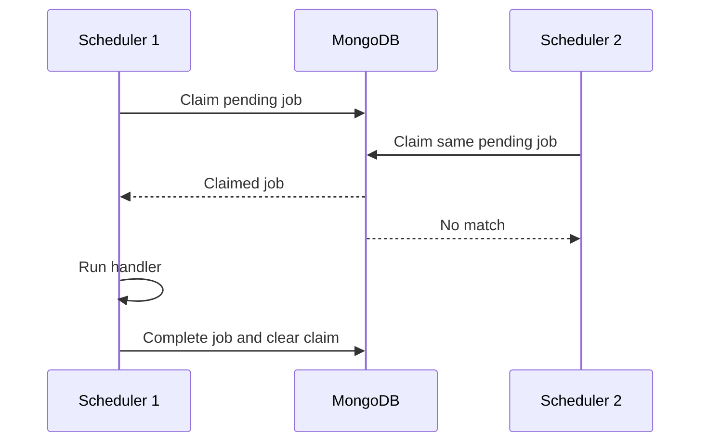

Multiple schedulers can process jobs from the same MongoDB collection. Monque claims each
due pending job with an atomic database operation, so only one scheduler claims that job
at a time.

This is at-least-once processing. A job can run again after a failure or crash recovery.
Use [idempotent handlers](/monque/core-concepts/jobs/#idempotent-operations) to avoid duplicate
side effects.

## Scheduler Instance ID

By default, each `Monque` instance gets a generated UUID. You can provide a unique ID to
identify its jobs in logs and the dashboard:

```typescript
import { hostname } from 'node:os';
import { randomUUID } from 'node:crypto';

const monque = new Monque(db, {
  schedulerInstanceId: `${hostname()}-${randomUUID()}`,
});
```

A processing job's `claimedBy` field contains its scheduler ID. Read the current job to
inspect it; an object returned by an earlier enqueue call does not update automatically:

```typescript
const current = await monque.getJob(jobId);
console.log(current?.claimedBy);
```

### Instance Collision Detection

Always assign different IDs to active instances. During initialization, Monque checks for
processing jobs with the same ID and a recent heartbeat. If it finds one, initialization
fails with `ConnectionError`.

This check does not reserve an ID for an idle scheduler. Use a unique ID even if the first
instance has no processing jobs.

## Multi-Instance Deployment

Use the same database and collection name in each process, and register the job handlers
that process should run:

```typescript
const monque = new Monque(db, {
  collectionName: 'monque_jobs',
  workerConcurrency: 5,
  instanceConcurrency: 20,
});

monque.register('send-email', emailHandler);
await monque.initialize();
monque.start();
```

Run this setup in each worker process. Jobs are assigned according to which instance
claims them first. Distribution is not guaranteed to be even.

Concurrency limits apply per instance. Two instances with concurrency 5 for the same worker
can run up to 10 jobs for that name in total. See [Workers](/monque/core-concepts/workers/)
for per-worker and instance-wide limits.

## Claim Lifecycle


```mermaid
sequenceDiagram
    participant W1 as Scheduler 1
    participant DB as MongoDB
    participant W2 as Scheduler 2
    W1->>DB: Claim pending job
    W2->>DB: Claim same pending job
    DB-->>W1: Claimed job
    DB-->>W2: No match
    W1->>W1: Run handler
    W1->>DB: Complete job and clear claim
```

On a successful one-time run, the job becomes completed. A successful recurring job returns
to pending at its next cron time. A failed run either returns to pending for retry or
becomes failed when retries are exhausted.

## Failure Handling

A crashed worker can leave a job in processing. With `recoverStaleJobs: true`, a subsequent
initialization recovers jobs whose `lockedAt` is older than `lockTimeout`. Heartbeat updates
do not extend that timeout. Choose a timeout longer than the longest valid handler run.
See [Heartbeat Mechanism](/monque/advanced/heartbeat/) for recovery settings.

Call `await monque.stop()` during shutdown, before closing the MongoDB client. It stops
claiming more jobs and waits for running handlers up to `shutdownTimeout`.

## Monitoring

Subscribe to `job:start`, `job:complete`, `job:fail`, and `job:error` for processing and
database errors. A claim lost to another scheduler is normal and does not by itself mean
that the job failed.

The [dashboard](/monque/dashboard/express/) shows persisted jobs from the shared collection,
but worker activity and scheduler health describe the instance connected to its Management API.
