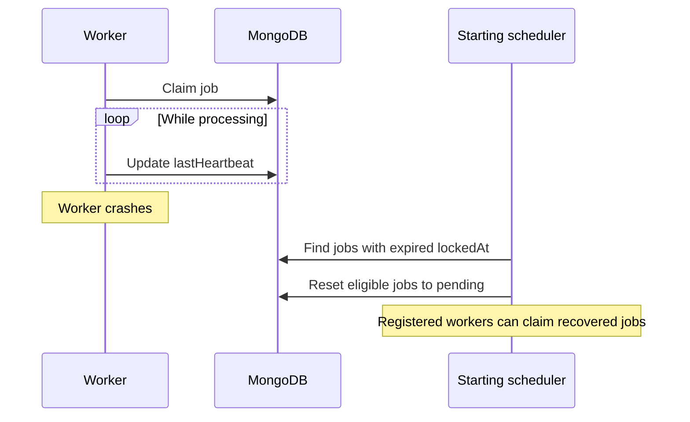

While a job is processing, Monque updates its `lastHeartbeat` timestamp. If the worker
crashes, that timestamp stops advancing and the job can remain in processing.

Startup recovery uses `lockedAt` and `lockTimeout`, not the most recent heartbeat. A fresh
heartbeat does not extend the allowed lock duration.

## Configuration

```typescript
const monque = new Monque(db, {
  heartbeatInterval: 30_000,
  lockTimeout: 30 * 60 * 1000,
  recoverStaleJobs: true,
});
```

| Option | Default | Purpose |
| --- | --- | --- |
| `heartbeatInterval` | 30 seconds | How often this instance updates heartbeats for its processing jobs. |
| `lockTimeout` | 30 minutes | Age of `lockedAt` after which a processing job is eligible for startup recovery. |
| `recoverStaleJobs` | `true` | Recover eligible jobs during initialization. |

Set `lockTimeout` above your longest expected job duration, with room for slower runs.
If a valid handler can take an hour, a 30-minute timeout can cause another initializing
instance to recover its job while it is still running.

## Stale Job Recovery

During `initialize()`, Monque finds processing jobs with expired locks, resets them to
pending, and clears their claim and heartbeat fields. Registered workers can then claim
them again once processing starts.



Recovery happens during initialization. A running instance does not continuously recover
jobs merely because their last heartbeat becomes old. Recovered jobs may repeat side
effects from an interrupted run, so workers must be
[idempotent](/monque/core-concepts/jobs/#idempotent-operations).

Set `recoverStaleJobs: false` only when your application provides its own recovery process.
Without recovery, jobs left processing after a crash can remain there indefinitely.

## Monitor Heartbeats

Read the current persisted job:

```typescript
const job = await monque.getJob(jobId);
if (job) {
  console.log(job.status, job.claimedBy, job.lockedAt, job.lastHeartbeat);
}
```

Heartbeats describe activity for jobs owned by each scheduler instance. Listen for
background update failures and recovery events:

```typescript
monque.on('job:error', ({ error }) => {
  console.error('Scheduler error:', error.message);
});
monque.on('stale:recovered', ({ count }) => {
  console.warn(`Recovered ${count} jobs`);
});
```

Register these listeners before `initialize()` to observe startup recovery.

## Shutdown

Call `await monque.stop()` before closing the MongoDB client. If a handler exceeds
`shutdownTimeout`, its job can remain processing and be recovered during a later
initialization after its lock expires. See
[Graceful shutdown](/monque/getting-started/quick-start/#handle-graceful-shutdown).

## Troubleshooting

| Symptom | Check |
| --- | --- |
| A running job is recovered by another instance | Increase `lockTimeout` to cover the entire handler duration. |
| Heartbeats stop advancing | Check worker process availability, database errors, and event-loop blocking. |
| Crashed jobs remain processing | Check `recoverStaleJobs`, the age of `lockedAt`, and whether a scheduler initialized after the lock expired. |
| Many jobs are recovered on each deployment | Check shutdown handling, handler duration, crash logs, and `shutdownTimeout`. |

Break up CPU-heavy work or move it off the event loop so heartbeat updates can run. This
helps heartbeat reporting but does not extend `lockTimeout`.
