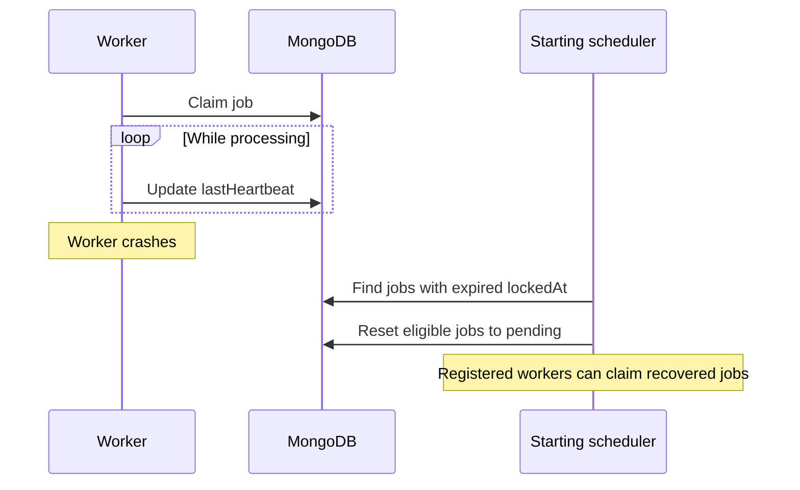

While a job is processing, Monque updates its `lastHeartbeat` timestamp. If the worker
crashes, that timestamp stops advancing and the job can remain in processing.

By default, startup recovery uses `lockedAt` and `lockTimeout`. A fresh heartbeat does not
extend that absolute timeout. Enable renewable leases when healthy jobs may run longer
than a fixed timeout or surviving schedulers should recover crashed work without restarting.

## Configuration

```typescript
const monque = new Monque(db, {
  heartbeatInterval: 30_000,
  lockTimeout: 30 * 60 * 1000,
  recoverStaleJobs: true,
});
```

| Option              | Default    | Purpose                                                                                                    |
| ------------------- | ---------- | ---------------------------------------------------------------------------------------------------------- |
| `heartbeatInterval` | 30 seconds | How often this instance updates heartbeats for its processing jobs.                                        |
| `lockTimeout`       | 30 minutes | Age of `lockedAt` after which a processing job is eligible for startup recovery.                           |
| `leaseDuration`     | Disabled   | Renewable claim lifetime in milliseconds; must exceed `heartbeatInterval` and be at most 2,147,483,647 ms. |
| `recoverStaleJobs`  | `true`     | Recover eligible jobs during initialization and, with leases enabled, during heartbeat maintenance.        |

Set `lockTimeout` above your longest expected job duration, with room for slower runs.
If a valid handler can take an hour, a 30-minute timeout can cause another initializing
instance to recover its job while it is still running.

## Renewable Leases

Upgrade every scheduler sharing the collection before enabling leases. Older versions
recover jobs by absolute lock age and cannot recognize a renewed lease.

```typescript
const monque = new Monque(db, {
  heartbeatInterval: 30_000,
  leaseDuration: 90_000,
});
```

The same settings work in Ts.ED's `monque` configuration. Give the lease several heartbeat
intervals of headroom for database delays and event-loop pauses. Each heartbeat extends
`leaseExpiresAt` using MongoDB's clock; `lockedAt` continues to identify the original claim
time. An expired lease cannot be revived by a delayed heartbeat or completed by a late handler.

With leases enabled, running schedulers recover expired leases and absolute locks
after each heartbeat. After a crash, recovery can take up to a lease duration plus
one `heartbeatInterval`, and longer during database outages.

Enabling leases affects new claims. Existing processing jobs keep their absolute lock
deadline until they finish or are recovered. Keep `lockTimeout` appropriate for those jobs.

## Stale Job Recovery

During `initialize()`, Monque finds processing jobs with expired locks, resets them to
pending, and clears their claim and heartbeat fields. Registered workers can then claim
them again once processing starts.


```mermaid
sequenceDiagram
    participant W as Worker
    participant DB as MongoDB
    participant S as Starting scheduler
    W->>DB: Claim job
    loop While processing
        W->>DB: Update lastHeartbeat
    end
    Note over W: Worker crashes
    S->>DB: Find jobs with expired lockedAt
    S->>DB: Reset eligible jobs to pending
    Note over S: Registered workers can claim recovered jobs
```

Without leases, recovery happens only during initialization. With leases, it also happens
while a scheduler remains running. Recovered jobs may repeat side effects from an
interrupted run, so workers must be
[idempotent](/monque/core-concepts/jobs/#idempotent-operations).

Set `recoverStaleJobs: false` only when your application provides its own recovery process.
Without recovery, jobs left processing after a crash can remain there indefinitely.

## Monitor Heartbeats

Read the current persisted job:

```typescript
const job = await monque.getJob(jobId);
if (job) {
  console.log(job.status, job.claimedBy, job.lockedAt, job.lastHeartbeat);
}
```

Heartbeats describe activity for jobs owned by each scheduler instance. Listen for
background update failures and recovery events:

```typescript
monque.on("job:error", ({ error }) => {
  console.error("Scheduler error:", error.message);
});
monque.on("stale:recovered", ({ count }) => {
  console.warn(`Recovered ${count} jobs`);
});
```

Register these listeners before `initialize()` to observe startup recovery.

## Shutdown

Call `await monque.stop()` before closing the MongoDB client. If a handler exceeds
`shutdownTimeout`, its job can remain processing until its claim expires and is recovered.
Renewable leases continue receiving heartbeats while handlers drain, then stop when shutdown
completes or times out. A timeout does not forcibly stop the handler's application code. See
[Graceful shutdown](/monque/getting-started/quick-start/#handle-graceful-shutdown).

## Troubleshooting

| Symptom                                        | Check                                                                                                                               |
| ---------------------------------------------- | ----------------------------------------------------------------------------------------------------------------------------------- |
| A running job is recovered by another instance | For absolute locks, increase `lockTimeout`. For leases, check renewal errors and increase the heartbeat headroom.                   |
| Heartbeats stop advancing                      | Check worker process availability, database errors, and event-loop blocking.                                                        |
| Crashed jobs remain processing                 | Check `recoverStaleJobs` and the claim deadline. Without leases enabled on a surviving scheduler, recovery requires initialization. |
| Many jobs are recovered on each deployment     | Check shutdown handling, handler duration, crash logs, and `shutdownTimeout`.                                                       |

Break up CPU-heavy work or move it off the event loop so heartbeats can run. Leases can
expire if renewal is blocked; heartbeats never extend a legacy absolute `lockTimeout`.
