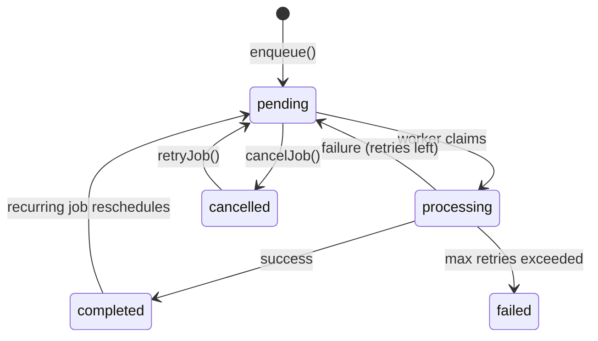

import { Aside } from "@astrojs/starlight/components";

A job stores the work you want a worker to perform, along with its payload, status, and scheduled time.

## Quick Reference

| Method / Type                                              | Description                                              |
| ---------------------------------------------------------- | -------------------------------------------------------- |
| [`Job`](/monque/api/interfaces/job/)                       | Job document interface                                   |
| [`enqueue()`](/monque/api/classes/monque/#enqueue)         | Create a job with optional scheduling                    |
| [`enqueueMany()`](/monque/api/classes/monque/#enqueuemany) | Submit a batch with per-job scheduling and deduplication |
| [`now()`](/monque/api/classes/monque/#now)                 | Create a job for immediate execution                     |
| [`schedule()`](/monque/api/classes/monque/#schedule)       | Create a recurring cron-based job                        |
| [`getJob()`](/monque/api/classes/monque/#getjob)           | Retrieve a single job by ID                              |
| [`getJobs()`](/monque/api/classes/monque/#getjobs)         | Query jobs with filters                                  |
| [`EnqueueOptions`](/monque/api/interfaces/enqueueoptions/) | Options for `enqueue()`                                  |
| [`JobStatus`](/monque/api/variables/jobstatus/)            | Status values object                                     |

## What is a Job?

Each job has:

- **Name**: Identifies which worker should process it
- **Data**: The payload containing information needed to complete the work
- **Status**: Current state in the lifecycle (`pending`, `processing`, `completed`, `failed`). Can be referenced via the [`JobStatus`](/monque/api/variables/jobstatus/) Object from `@monque/core`.
- **Scheduling**: When the job should run (`nextRunAt`)
- **Priority**: Which due Job is claimed next within its Job Name (`priority`, default `0`)

## Job Interface

For the full interface definition, see the [Job API Reference](/monque/api/interfaces/job/).

## Job Lifecycle


```mermaid
stateDiagram-v2
    [*] --> pending: enqueue()
    pending --> processing: worker claims
    pending --> cancelled: cancelJob()
    processing --> completed: success
    processing --> pending: failure (retries left)
    processing --> failed: max retries exceeded
    completed --> pending: recurring job reschedules
    cancelled --> pending: retryJob()
```

### Status Definitions

| Status       | Description                                         |
| ------------ | --------------------------------------------------- |
| `pending`    | Job is waiting to be picked up by a worker          |
| `processing` | A worker has claimed and is executing the job       |
| `completed`  | Job finished successfully                           |
| `failed`     | Job permanently failed after exhausting all retries |
| `cancelled`  | Job was manually cancelled via cancelJob()          |

## Creating Jobs

### Immediate Execution

Use [`now()`](/monque/api/classes/monque/#now) to create a Job that is due immediately.
It accepts optional `priority` and `session` options:

```typescript
import { Monque } from "@monque/core";
import { MongoClient } from "mongodb";

const client = new MongoClient("mongodb://localhost:27017");
await client.connect();
const db = client.db("myapp");

const monque = new Monque(db);
await monque.initialize();

// Enqueue for immediate execution
const job = await monque.now("send-email", {
  to: "user@example.com",
  subject: "Hello!",
});

console.log(job._id); // ObjectId
console.log(job.status); // 'pending'
```

### Enqueue a Batch

Use `enqueueMany()` when submitting several jobs together:

```typescript
const result = await monque.enqueueMany([
  { name: "send-email", data: { userId: "123" }, priority: 10, uniqueKey: "welcome-123" },
  {
    name: "send-reminder",
    data: { userId: "123" },
    runAt: new Date(Date.now() + 3600000),
  },
]);

console.log(result.insertedCount, result.deduplicatedCount);
```

Each item accepts `name`, `data`, `priority`, `runAt`, and `uniqueKey`. An empty batch returns
zero counts. Priorities, names, unique keys, and configured payload size limits are validated
for every item before any writes. Standard Schema validation still runs when a
worker claims each job.

Deduplication uses the same rules as `enqueue()`: an existing pending or processing
job with the same name and unique key keeps its priority, payload, and schedule. Writes are
unordered; when new items share a key, do not rely on which payload or priority wins. Completed,
failed, and cancelled jobs do not block a new job with that key.

The result contains counts, not job documents. Without a transaction, a database
error can leave some jobs persisted while other jobs fail. `ConnectionError.cause`
contains the MongoDB error and any available partial results. Use stable unique keys when retrying, and remember
that deduplication lasts only while a job is pending or processing.

### Enqueue in a Transaction

Pass a MongoDB `ClientSession` to `enqueue()`, `now()`, `enqueueMany()`, or `schedule()` to
commit business data and jobs together. Use the same `MongoClient` that created
Monque's database, and initialize Monque before starting the transaction.

```typescript
await client.withSession(async (session) => {
  await session.withTransaction(async () => {
    await db.collection("orders").insertOne(order, { session });
    await monque.enqueue(
      "send-receipt",
      { orderId: order._id },
      {
        session,
        uniqueKey: order._id.toString(),
        priority: 10,
      },
    );
    await monque.enqueueMany(
      [{ name: "update-stock", data: { orderId: order._id }, priority: -5 }],
      { session },
    );
    await monque.schedule(
      "0 9 * * *",
      "daily-report",
      {},
      {
        session,
        priority: 5,
        timezone: "UTC",
        uniqueKey: "daily-report",
      },
    );
  });
});
```

Workers see the jobs only after commit. Aborting rolls back the jobs along with
the business writes. Monque never starts, commits, aborts, or ends your session.
Passing a session alone does not start a transaction; use `withTransaction()` or
the driver's explicit transaction methods. MongoDB transactions require a replica
set or sharded cluster.

Await operations sequentially inside the transaction. Native database errors are
propagated unchanged during a transaction, preserving the driver's retry labels.
Let `withTransaction()` retry eligible failures, and keep external side effects
outside its callback. Do not catch a failed write and continue using an aborted
transaction. A returned job or batch count is provisional until commit succeeds.

Change streams wake workers after commit. When streams are unavailable, committed
jobs are discovered within the configured `pollInterval`.

### Scheduled Execution

Use [`enqueue()`](/monque/api/classes/monque/#enqueue) with `runAt` for delayed execution:

```typescript
// Run in 1 hour
const job = await monque.enqueue(
  "send-reminder",
  {
    userId: "123",
    message: "Check back soon!",
  },
  {
    runAt: new Date(Date.now() + 3600000),
  },
);
```

### Recurring Jobs

Use [`schedule()`](/monque/api/classes/monque/#schedule) for cron-based recurring jobs:

```typescript
// Every day at midnight
const job = await monque.schedule(
  "0 0 * * *",
  "daily-report",
  { reportType: "sales" },
  { priority: 5, timezone: "UTC" },
);
```

Recurring schedules accept the same signed safe-integer `priority` as single and batch
Jobs. The default is `0`. Automatic and manual retries, rescheduling, stale recovery,
and later recurring runs retain the Job's priority. The saved timezone and cron schedule
determine when it becomes due. Returned Jobs, lifecycle events, Management responses,
and the Dashboard all show priority.

## Preventing Duplicates

Use [`uniqueKey`](/monque/api/interfaces/enqueueoptions/#uniquekey) to prevent duplicate jobs:

```typescript
// Only one sync job per user at a time
await monque.enqueue(
  "sync-user",
  { userId: "123" },
  {
    uniqueKey: "sync-user-123",
  },
);

// Attempting to enqueue again returns the existing job
const existing = await monque.enqueue(
  "sync-user",
  { userId: "123" },
  {
    uniqueKey: "sync-user-123",
  },
);
// existing._id === original job's _id
```

<Aside type="note">
  `uniqueKey` only prevents duplicates when a job with that key is in `pending` or `processing`
  status. Completed and failed jobs don't block new ones.
</Aside>

## Querying Jobs

### Get Jobs by Filter

```typescript
import { JobStatus } from "@monque/core";

// All pending email jobs
const pendingEmails = await monque.getJobs({
  name: "send-email",
  status: JobStatus.PENDING,
});

// All failed jobs (with pagination)
const failedJobs = await monque.getJobs({
  status: JobStatus.FAILED,
  limit: 50,
  skip: 0,
});

// Multiple statuses
const activeJobs = await monque.getJobs({
  status: [JobStatus.PENDING, JobStatus.PROCESSING],
});
```

### Get Single Job by ID

```typescript
import { ObjectId } from "mongodb";

const job = await monque.getJob(new ObjectId("507f1f77bcf86cd799439011"));
if (job) {
  console.log(job.status, job.data);
}
```

You can also pass the hexadecimal ID string directly. Use
[metadata-only pagination](/monque/core-concepts/management/#metadata-only-listings) for large
job lists that do not need payloads.

## Job Data Best Practices

### Keep Payloads Small

Store identifiers in the payload and load larger documents in the handler:

```typescript
// ✅ Good - Store ID, fetch data in worker
await monque.enqueue("process-order", { orderId: "123" });

// ❌ Bad - Large embedded data
await monque.enqueue("process-order", {
  order: {/* entire order document */},
});
```

### Payload Size Validation

Use `maxPayloadSize` to enforce a hard BSON byte limit on all job payloads. When set, `enqueue()`, `now()`, and `schedule()` measure the payload using `BSON.calculateObjectSize()` before insertion and throw `PayloadTooLargeError` if the limit is exceeded.

```typescript
import { Monque, PayloadTooLargeError } from "@monque/core";

const monque = new Monque(db, {
  maxPayloadSize: 100_000, // 100 KB hard limit
});

try {
  await monque.enqueue("process-report", hugePayload);
} catch (error) {
  if (error instanceof PayloadTooLargeError) {
    console.error(`Payload too large: ${error.actualSize} bytes (limit: ${error.maxSize} bytes)`);
  }
}
```

`PayloadTooLargeError` exposes two properties:

- `actualSize`: measured BSON byte size of the payload
- `maxSize`: the configured limit

<Aside type="tip">
  A good starting limit is `100_000` (100 KB). MongoDB's absolute document limit is 16 MB, but
  smaller payloads keep queues fast and memory usage predictable.
</Aside>

When `maxPayloadSize` is not set (the default), no validation is performed.

### Use Type-Safe Payloads

Define interfaces for your job data:

```typescript
interface ProcessOrderJob {
  orderId: string;
  priority: "urgent" | "normal";
}

// Type-safe enqueue
await monque.enqueue<ProcessOrderJob>("process-order", {
  orderId: "123",
  priority: "urgent",
});

// Type-safe worker
monque.register<ProcessOrderJob>("process-order", async (job) => {
  const { orderId, priority } = job.data; // TypeScript knows the types
});
```

### Idempotent Operations

Design workers to handle concurrent duplicates and retries after partial failure.
Atomic claims prevent two workers from claiming the same pending Job at once. Recovery
can expire a claim while its original handler still runs; claim ownership protects
Monque's state, but cannot cancel an external side effect.

For external calls, reuse a stable business-operation key with a provider that supports
idempotency. This application adapter must forward the key and handle the provider's
response to concurrent requests with that key:

```typescript
monque.register("charge-payment", async (job) => {
  const { paymentId, amount, currency } = job.data;
  await paymentProvider.charge(
    { paymentId, amount, currency },
    { idempotencyKey: `charge:${paymentId}` },
  );
});
```

Keep the request details fixed and respect the provider's key-retention period. Checking
a local payment status before making a call cannot prevent concurrent charges or recover
a lost response safely. For MongoDB-only effects, use a transaction with a unique
operation identifier. See [Idempotency patterns](/monque/advanced/production-checklist/#idempotency-patterns)
for both approaches and their prerequisites.

## Job Retention

Set retention periods to delete old completed, failed, and cancelled jobs automatically:

```typescript
const monque = new Monque(db, {
  // ... other options
  jobRetention: {
    completed: 24 * 60 * 60 * 1000, // Keep completed jobs for 24 hours
    failed: 7 * 24 * 60 * 60 * 1000, // Keep failed jobs for 7 days
    cancelled: 24 * 60 * 60 * 1000, // Keep cancelled jobs for 24 hours
    interval: 60 * 60 * 1000, // Run cleanup every hour (default)
  },
});
```

<Aside type="note">
  Each status is opt-in: omitting its retention period keeps those jobs indefinitely. If
  `jobRetention` is not configured, no automatic cleanup is performed.
</Aside>

Retention uses `updatedAt`, so cancelled jobs age from their cancellation time, not their
creation time. A period of `0` makes that status eligible on the next cleanup pass.
Cleanup runs when the scheduler starts and at `interval`; you do not need a cron job.
Pending and processing jobs are never removed by retention.

## Indexes

During `initialize()`, Monque creates indexes for job discovery, deduplication, ownership,
recovery, and pagination.

<Aside type="note">
  Grant Monque permission to create indexes, or set `skipIndexCreation: true` and manage the full
  index set yourself.
</Aside>

Listing indexes include:

- `{ createdAt: -1, _id: -1 }`
- `{ name: 1, createdAt: -1, _id: -1 }`
- `{ status: 1, createdAt: -1, _id: -1 }`
- `{ updatedAt: -1, _id: -1 }`
- `{ nextRunAt: -1, _id: -1 }`

The `_id` field breaks ties for stable ordering. Name and status indexes support filtered
creation-time listings. A cleanup index is also created when `jobRetention` is configured.
Enabling `jobRetention.cancelled` adds a partial `updatedAt` index for cancelled jobs;
existing retention indexes remain valid when upgrading.
Without `skipIndexCreation: true`, initialization requires index permissions even if indexes
already exist. Priority claims and deadline discovery use separate indexes. Keep both when
managing indexes yourself; see the
[production index guidance](/monque/advanced/production-checklist/#10-ensure-index-permissions).

### Deleting Jobs

You can use the deletion APIs for manual cleanup:

- `deleteJob(jobId)`: Permanently delete a single job.
- `deleteJobs(filter)`: Delete multiple jobs matching criteria (name, status, age).

```typescript
// Delete a specific job
await monque.deleteJob(jobId);

// Delete all failed jobs older than 7 days
await monque.deleteJobs({
  status: JobStatus.FAILED,
  olderThan: new Date(Date.now() - 7 * 24 * 60 * 60 * 1000),
});
```

### Advanced Custom Cleanup

If you need more complex retention logic (e.g., keep important sales reports longer), implement a custom scheduled job that uses the MongoDB driver directly:

```typescript
import { JobStatus } from "@monque/core";

await monque.schedule("0 3 * * *", "custom-cleanup", {});

monque.register("custom-cleanup", async () => {
  // Access the jobs collection via your own MongoDB client.
  // Use the same collection name you configured for Monque (default: 'monque_jobs').
  const collection = db.collection("monque_jobs");

  const cutoffDate = new Date(Date.now() - 30 * 24 * 60 * 60 * 1000); // 30 days ago

  // Delete old completed/failed jobs (never delete 'processing' jobs!)
  await collection.deleteMany({
    status: { $in: [JobStatus.COMPLETED, JobStatus.FAILED] },
    updatedAt: { $lt: cutoffDate },
    // Add custom filter logic here, e.g., exclude important reports
    name: { $ne: "important-report" },
  });
});
```

## Next Steps

- [Workers](/monque/core-concepts/workers/) - Learn how to process jobs
- [Scheduling](/monque/core-concepts/scheduling/) - Use cron expressions
- [Retry & Backoff](/monque/core-concepts/retry/) - Configure retry behavior

## API Reference

- [`Job`](/monque/api/interfaces/job/) - Full job document interface
- [`PersistedJob`](/monque/api/type-aliases/persistedjob/) - Type returned from enqueue operations
- [`Monque.enqueue()`](/monque/api/classes/monque/#enqueue) - Enqueue a job
- [`Monque.now()`](/monque/api/classes/monque/#now) - Immediate execution sugar
- [`Monque.schedule()`](/monque/api/classes/monque/#schedule) - Recurring job scheduling
- [`Monque.getJob()`](/monque/api/classes/monque/#getjob) - Get job by ID
- [`Monque.getJobs()`](/monque/api/classes/monque/#getjobs) - Query jobs
- [`EnqueueOptions`](/monque/api/interfaces/enqueueoptions/) - Enqueue options
- [`GetJobsFilter`](/monque/api/interfaces/getjobsfilter/) - Job query filter
- [`JobStatus`](/monque/api/variables/jobstatus/) - Status constants
