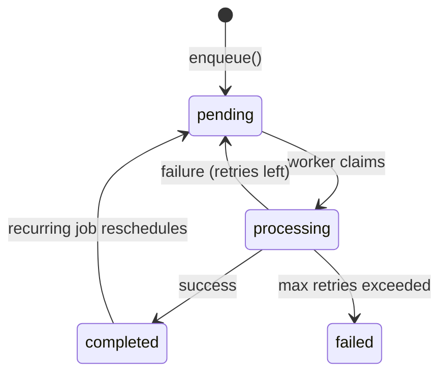

import { Aside } from '@astrojs/starlight/components';

Jobs are the fundamental unit of work in Monque. This guide explains how jobs work, their lifecycle, and how to work with them effectively.

## Quick Reference

| Method / Type | Description |
|---------------|-------------|
| [`Job`](/monque/api/interfaces/job/) | Job document interface |
| [`enqueue()`](/monque/api/classes/monque/#enqueue) | Create a job with optional scheduling |
| [`now()`](/monque/api/classes/monque/#now) | Create a job for immediate execution |
| [`schedule()`](/monque/api/classes/monque/#schedule) | Create a recurring cron-based job |
| [`getJob()`](/monque/api/classes/monque/#getjob) | Retrieve a single job by ID |
| [`getJobs()`](/monque/api/classes/monque/#getjobs) | Query jobs with filters |
| [`EnqueueOptions`](/monque/api/interfaces/enqueueoptions/) | Options for `enqueue()` |
| [`JobStatus`](/monque/api/variables/jobstatus/) | Status values object |

## What is a Job?

A job represents a unit of work to be processed asynchronously. Each job has:

- **Name**: Identifies which worker should process it
- **Data**: The payload containing information needed to complete the work
- **Status**: Current state in the lifecycle (`pending`, `processing`, `completed`, `failed`). Can be referenced via the [`JobStatus`](/monque/api/variables/jobstatus/) Object from `@monque/core`.
- **Scheduling**: When the job should run (`nextRunAt`)

## Job Interface

For the full interface definition, see the [Job API Reference](/monque/api/interfaces/job/).

## Job Lifecycle



### Status Definitions

| Status       | Description                                         |
| ------------ | --------------------------------------------------- |
| `pending`    | Job is waiting to be picked up by a worker          |
| `processing` | A worker has claimed and is executing the job       |
| `completed`  | Job finished successfully                           |
| `failed`     | Job permanently failed after exhausting all retries |

## Creating Jobs

### Immediate Execution

Use [`now()`](/monque/api/classes/monque/#now) for jobs that should run immediately. This is sugar for `enqueue()` without scheduling options:

```typescript
import { Monque } from '@monque/core';
import { MongoClient } from 'mongodb';

const client = new MongoClient('mongodb://localhost:27017');
await client.connect();
const db = client.db('myapp');

const monque = new Monque(db);
await monque.initialize();

// Enqueue for immediate execution
const job = await monque.now('send-email', {
  to: 'user@example.com',
  subject: 'Hello!'
});

console.log(job._id); // ObjectId
console.log(job.status); // 'pending'
```

### Scheduled Execution

Use [`enqueue()`](/monque/api/classes/monque/#enqueue) with `runAt` for delayed execution:

```typescript
// Run in 1 hour
const job = await monque.enqueue('send-reminder', {
  userId: '123',
  message: 'Check back soon!'
}, {
  runAt: new Date(Date.now() + 3600000)
});
```

### Recurring Jobs

Use [`schedule()`](/monque/api/classes/monque/#schedule) for cron-based recurring jobs:

```typescript
// Every day at midnight
const job = await monque.schedule('0 0 * * *', 'daily-report', {
  reportType: 'sales'
});
```

## Preventing Duplicates

Use [`uniqueKey`](/monque/api/interfaces/enqueueoptions/#uniquekey) to prevent duplicate jobs:

```typescript
// Only one sync job per user at a time
await monque.enqueue('sync-user', { userId: '123' }, {
  uniqueKey: 'sync-user-123'
});

// Attempting to enqueue again returns the existing job
const existing = await monque.enqueue('sync-user', { userId: '123' }, {
  uniqueKey: 'sync-user-123'
});
// existing._id === original job's _id
```

<Aside type="note">
  `uniqueKey` only prevents duplicates when a job with that key is in `pending` or `processing` status. Completed and failed jobs don't block new ones.
</Aside>

## Querying Jobs

### Get Jobs by Filter

```typescript
import { JobStatus } from '@monque/core';

// All pending email jobs
const pendingEmails = await monque.getJobs({
  name: 'send-email',
  status: JobStatus.PENDING
});

// All failed jobs (with pagination)
const failedJobs = await monque.getJobs({
  status: JobStatus.FAILED,
  limit: 50,
  skip: 0
});

// Multiple statuses
const activeJobs = await monque.getJobs({
  status: [JobStatus.PENDING, JobStatus.PROCESSING]
});
```

### Get Single Job by ID

```typescript
import { ObjectId } from 'mongodb';

const job = await monque.getJob(new ObjectId('...'));
if (job) {
  console.log(job.status, job.data);
}
```

## Job Data Best Practices

### Keep Payloads Small

Job data should be reference data, not full documents:

```typescript
// ✅ Good - Store ID, fetch data in worker
await monque.enqueue('process-order', { orderId: '123' });

// ❌ Bad - Large embedded data
await monque.enqueue('process-order', { 
  order: { /* entire order document */ }
});
```

### Use Type-Safe Payloads

Define interfaces for your job data:

```typescript
interface ProcessOrderJob {
  orderId: string;
  priority: 'urgent' | 'normal';
}

// Type-safe enqueue
await monque.enqueue<ProcessOrderJob>('process-order', {
  orderId: '123',
  priority: 'urgent'
});

// Type-safe worker
monque.worker<ProcessOrderJob>('process-order', async (job) => {
  const { orderId, priority } = job.data; // TypeScript knows the types
});
```

### Idempotent Operations

Design workers to handle duplicate execution safely:

<Aside type="note">
  **Why jobs might run twice:** Monque ensures a job is only claimed by one worker at a time. However, a job can be re-run in scenarios such as:
  
  - **Retries**: If a job fails, the [retry logic](/monque/core-concepts/retry/) will re-queue it.
  - **Stale Recovery**: If a worker crashes or stops sending heartbeats, the recovery mechanism will re-queue the job.
  
  Always design your workers to be idempotent (safe to run multiple times).
</Aside>

```typescript
monque.register('charge-payment', async (job) => {
  const { paymentId } = job.data;
  
  // Check if already processed
  const payment = await db.payments.findOne({ _id: paymentId });
  if (payment.status === 'charged') {
    return; // Already done, safe to skip
  }
  
  // Process payment
  await chargePayment(payment);
});
```

## Job Retention

Monque provides built-in job retention to automatically clean up completed and failed jobs. This prevents your database from growing indefinitely.

You can configure retention when initializing Monque:

```typescript
const monque = new Monque(db, {
  // ... other options
  jobRetention: {
    completed: 24 * 60 * 60 * 1000,    // Keep completed jobs for 24 hours
    failed: 7 * 24 * 60 * 60 * 1000,   // Keep failed jobs for 7 days
    interval: 60 * 60 * 1000           // Run cleanup every hour (default)
  }
});
```

<Aside type="note">
  If `jobRetention` is not configured, no automatic cleanup is performed.
</Aside>

## Indexes

Monque creates MongoDB indexes during `initialize()` to keep polling, claiming, deduplication, and recovery queries fast.

<Aside type="note">
  Your MongoDB user must have permission to create indexes. If index creation is restricted in production, create the required indexes ahead of time.
</Aside>

The indexes Monque creates are:

- `{ status: 1, nextRunAt: 1 }` for efficient polling (ready-to-run jobs)
- `{ name: 1, uniqueKey: 1 }` as a **partial unique** index for deduplication (only when `uniqueKey` exists and status is `pending`/`processing`)
- `{ name: 1, status: 1 }` for querying by job type and status
- `{ claimedBy: 1, status: 1 }` for ownership queries and heartbeat updates
- `{ lastHeartbeat: 1, status: 1 }` for heartbeat-based monitoring queries
- `{ status: 1, nextRunAt: 1, claimedBy: 1 }` for the atomic claim query
- `{ status: 1, lockedAt: 1, lastHeartbeat: 1 }` to support stale recovery queries

### Manual Cleanup

If you need more complex retention logic (e.g., keep important sales reports longer), implement a custom scheduled job that uses the MongoDB driver directly:

<Aside type="note">
  Monque does not expose a public `deleteJob` API in v1.0. Use the MongoDB driver for custom deletion logic.
</Aside>

```typescript
import { JobStatus } from '@monque/core';

await monque.schedule('0 3 * * *', 'custom-cleanup', {});

monque.register('custom-cleanup', async () => {
  // Access the jobs collection via your own MongoDB client.
  // Use the same collection name you configured for Monque (default: 'monque_jobs').
  const collection = db.collection('monque_jobs');
  
  const cutoffDate = new Date(Date.now() - 30 * 24 * 60 * 60 * 1000); // 30 days ago
  
  // Delete old completed/failed jobs (never delete 'processing' jobs!)
  await collection.deleteMany({
    status: { $in: [JobStatus.COMPLETED, JobStatus.FAILED] },
    updatedAt: { $lt: cutoffDate },
    // Add custom filter logic here, e.g., exclude important reports
    name: { $ne: 'important-report' }
  });
});
```

## Next Steps

- [Workers](/monque/core-concepts/workers/) - Learn how to process jobs
- [Scheduling](/monque/core-concepts/scheduling/) - Deep dive into cron expressions
- [Retry & Backoff](/monque/core-concepts/retry/) - Configure retry behavior

## API Reference

- [`Job`](/monque/api/interfaces/job/) - Full job document interface
- [`PersistedJob`](/monque/api/type-aliases/persistedjob/) - Type returned from enqueue operations
- [`Monque.enqueue()`](/monque/api/classes/monque/#enqueue) - Enqueue a job
- [`Monque.now()`](/monque/api/classes/monque/#now) - Immediate execution sugar
- [`Monque.schedule()`](/monque/api/classes/monque/#schedule) - Recurring job scheduling
- [`Monque.getJob()`](/monque/api/classes/monque/#getjob) - Get job by ID
- [`Monque.getJobs()`](/monque/api/classes/monque/#getjobs) - Query jobs
- [`EnqueueOptions`](/monque/api/interfaces/enqueueoptions/) - Enqueue options
- [`GetJobsFilter`](/monque/api/interfaces/getjobsfilter/) - Job query filter
- [`JobStatus`](/monque/api/variables/jobstatus/) - Status constants
