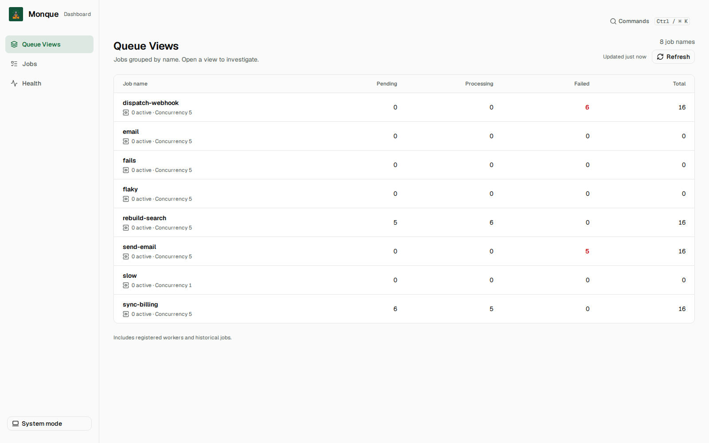
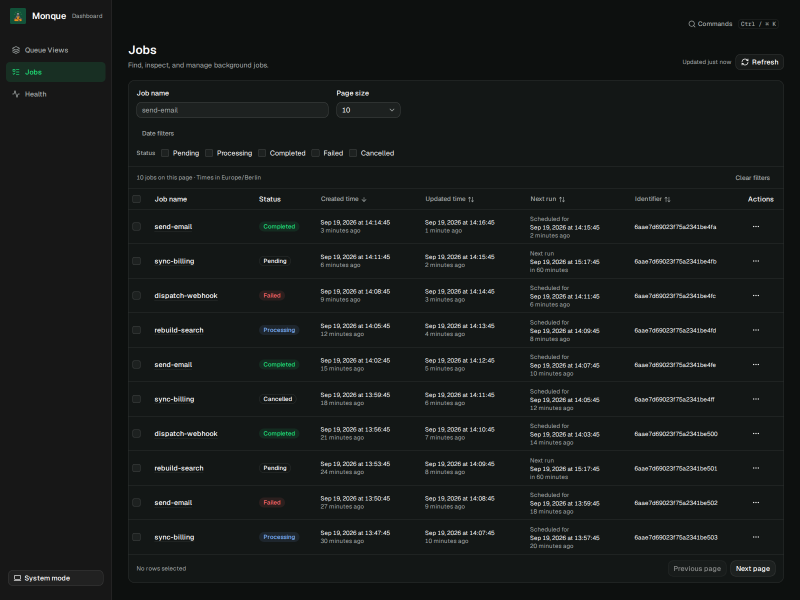
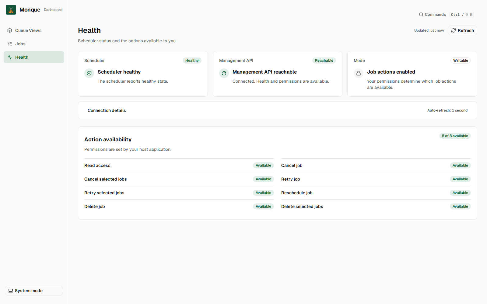

# @monque/dashboard

Inspect Monque jobs and scheduler health in your browser. Filter a job list, share its URL,
or open a job to view its payload and failures. You can retry, cancel, reschedule, or delete
jobs when your API permissions allow it.

The dashboard supports light and dark themes and mobile layouts.

## Installation

For Express applications, install the dashboard and Management API adapters:

```bash
bun add @monque/dashboard-express @monque/management-express @monque/management @monque/core express mongodb
```

Requires Node.js 22.12 or newer and Express 5.2.1 or newer within version 5.
The Express adapter includes the built dashboard, so you do not need a frontend build or React installation.

## Usage

In your Express server, mount both routers using your initialized `Monque` instance:

```typescript
import { createDashboardExpressRouter } from '@monque/dashboard-express';
import { createManagementExpressRouter } from '@monque/management-express';

app.use('/ops', createManagementExpressRouter({ monque }));
app.use(
	'/ops/dashboard',
	createDashboardExpressRouter({
		apiBaseUrl: '/ops',
		pollingIntervalMs: 15_000,
	}),
);
```

Open `/ops/dashboard` on your application's origin. `apiBaseUrl` is the Management router's
mount path, **without `/api/v1`**. The dashboard's base path comes from its Express mount.
Omit `pollingIntervalMs` to disable automatic polling. Job lists use this base interval; queue
statistics and health refresh every three intervals, and Health permissions every six. Polling
adds up to 10% jitter, backs off after errors, and pauses in hidden tabs. Relative timestamps
update locally without API requests.

All configuration is passed through the router options in your server code. The Express adapter
handles browser configuration, assets, and direct links automatically.

See the [Express README](../dashboard-express/README.md) for a complete server example,
authentication, and configuration options.

## Screenshots

<table>
  <tr>
    <th>Queue Views</th>
    <th>Jobs</th>
    <th>Health</th>
  </tr>
  <tr>
    <td><a href="../../assets/dashboard/queue-views-light.png"></a></td>
    <td><a href="../../assets/dashboard/jobs-dark.png"></a></td>
    <td><a href="../../assets/dashboard/health-light.png"></a></td>
  </tr>
  <tr>
    <td><a href="../../assets/dashboard/queue-views-light.png">Light</a> · <a href="../../assets/dashboard/queue-views-dark.png">Dark</a></td>
    <td><a href="../../assets/dashboard/jobs-light.png">Light</a> · <a href="../../assets/dashboard/jobs-dark.png">Dark</a></td>
    <td><a href="../../assets/dashboard/health-light.png">Light</a> · <a href="../../assets/dashboard/health-dark.png">Dark</a></td>
  </tr>
</table>

## Other integrations

For a custom server adapter, use `getDashboardAssetMetadata()` to locate the built browser
assets. The package does not export an embeddable React component. Use the Express adapter
if you want a ready-made router.

To work on the dashboard in this repository, see [dashboard-dev](../../apps/dashboard-dev/README.md).
