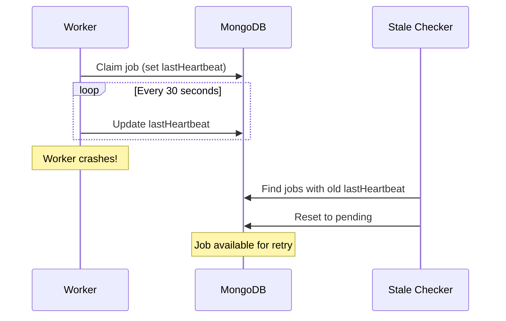

import { Aside } from '@astrojs/starlight/components';

The heartbeat mechanism ensures jobs aren't lost when a worker crashes. Processing workers periodically update a timestamp, allowing the system to detect and recover abandoned jobs.

## The Problem

When a worker crashes mid-processing:

1. Job remains in `processing` status
2. `claimedBy` still points to crashed instance
3. No other worker can pick it up
4. Job is effectively lost

## The Solution: Heartbeats

Workers periodically update `lastHeartbeat` for jobs they're processing. If heartbeats stop, the job is considered abandoned and can be recovered.

### How It Works



## Configuration

```typescript
const monque = new Monque(db, {
  heartbeatInterval: 30000,   // Update heartbeat every 30s (default)
  lockTimeout: 1800000,       // Consider stale after 30 minutes (default)
  recoverStaleJobs: true      // Recover on startup (default)
});
```

### Options Explained

| Option              | Default           | Description                                    |
| ------------------- | ----------------- | ---------------------------------------------- |
| `heartbeatInterval` | `30000` (30s)     | How often to update heartbeat while processing |
| `lockTimeout`       | `1800000` (30min) | Time without heartbeat before job is stale     |
| `recoverStaleJobs`  | `true`            | Whether to recover stale jobs on startup       |

<Aside type="tip">
  Set `lockTimeout` to at least 2× your longest expected job duration. This prevents recovering jobs that are still legitimately processing.
</Aside>

## Heartbeat Lifecycle

### 1. Job Claimed

When a worker claims a job:

```typescript
// Job document after claim
{
  status: 'processing',
  claimedBy: 'worker-1',
  lockedAt: ISODate("2024-01-15T10:00:00Z"),
  lastHeartbeat: ISODate("2024-01-15T10:00:00Z")
}
```

### 2. During Processing

Every `heartbeatInterval` milliseconds:

```typescript
// Update query (internal)
await collection.updateMany(
  { claimedBy: this.instanceId, status: 'processing' },
  { $set: { lastHeartbeat: new Date() } }
);
```

### 3. Job Completion

When job completes or fails:

```typescript
// Fields cleared
{
  status: 'completed',  // or 'failed' / 'pending' for retry
  claimedBy: null,
  lockedAt: null,
  lastHeartbeat: null
}
```

## Stale Job Recovery

### On Startup

When `start()` is called with `recoverStaleJobs: true`:

```typescript
// Find and reset stale jobs
const cutoffTime = new Date(Date.now() - lockTimeout);

const result = await collection.updateMany(
  {
    status: 'processing',
    lastHeartbeat: { $lt: cutoffTime }
  },
  {
    $set: { status: 'pending', claimedBy: null, lockedAt: null }
  }
);

// Event emitted
monque.emit('stale:recovered', { count: result.modifiedCount });
```

### Monitoring Recovery

```typescript
monque.on('stale:recovered', ({ count }) => {
  if (count > 0) {
    console.log(`Recovered ${count} stale jobs`);
    metrics.increment('monque.stale_jobs_recovered', count);
  }
});
```

## Disabling Stale Recovery

In some cases, you may want manual control:

```typescript
const monque = new Monque(db, {
  recoverStaleJobs: false
});

// Manual recovery
async function recoverStaleJobs() {
  const cutoff = new Date(Date.now() - 30 * 60 * 1000);
  
  const result = await db.collection('monque_jobs').updateMany(
    { status: 'processing', lastHeartbeat: { $lt: cutoff } },
    { $set: { status: 'pending', claimedBy: null } }
  );
  
  return result.modifiedCount;
}
```

<Aside type="caution">
  Only disable automatic recovery if you have a specific reason (e.g., custom recovery logic, debugging).
</Aside>

## Best Practices

### 1. Tune Timeouts for Your Workload

```typescript
// Short jobs (< 1 minute)
const shortJobMonque = new Monque(db, {
  heartbeatInterval: 10000,   // 10 seconds
  lockTimeout: 120000         // 2 minutes
});

// Long jobs (up to 1 hour)
const longJobMonque = new Monque(db, {
  heartbeatInterval: 60000,   // 1 minute
  lockTimeout: 3600000        // 1 hour
});
```

### 2. Monitor Heartbeat Health

```typescript
// Track heartbeat updates
let lastHeartbeat = Date.now();

const originalStart = monque.start.bind(monque);
monque.start = function() {
  setInterval(() => {
    const elapsed = Date.now() - lastHeartbeat;
    if (elapsed > heartbeatInterval * 2) {
      alerting.warn('Heartbeat delayed', { elapsed });
    }
  }, heartbeatInterval);
  
  return originalStart();
};
```

### 3. Handle Long-Running Jobs

For jobs that may exceed `lockTimeout`:

```typescript
monque.worker('long-analysis', async (job) => {
  const chunks = splitIntoChunks(job.data);
  
  for (const chunk of chunks) {
    // Process in chunks to allow heartbeats between
    await processChunk(chunk);
    // Heartbeat updates automatically during processing
  }
});
```

### 4. Log Stale Recoveries

```typescript
monque.on('stale:recovered', ({ count }) => {
  if (count > 0) {
    logger.warn('Stale jobs recovered', {
      count,
      possibleCauses: [
        'Worker crash',
        'Network partition',
        'Job exceeded lockTimeout'
      ]
    });
  }
});
```

## Troubleshooting

### Jobs Recovered Too Aggressively

**Symptom**: Jobs in progress are being reset

**Solution**: Increase `lockTimeout`:
```typescript
const monque = new Monque(db, {
  lockTimeout: 3600000  // 1 hour instead of 30 minutes
});
```

### Jobs Never Recovered

**Symptom**: Stale jobs remain stuck

**Checks**:
1. Verify `recoverStaleJobs: true`
2. Check `lockTimeout` isn't too high
3. Ensure `start()` was called

### High Stale Recovery Count

**Symptom**: Many jobs recovered on each startup

**Possible Causes**:
- Frequent worker crashes
- Jobs taking longer than `lockTimeout`
- Network instability causing heartbeat failures

**Investigation**:
```typescript
// Query to find stale job patterns
const staleJobs = await db.collection('monque_jobs').find({
  status: 'processing',
  lastHeartbeat: { $lt: new Date(Date.now() - lockTimeout) }
}).toArray();

// Analyze by job name
const byName = staleJobs.reduce((acc, job) => {
  acc[job.name] = (acc[job.name] || 0) + 1;
  return acc;
}, {});

console.log('Stale jobs by type:', byName);
```

## Index Support

Monque creates indexes optimized for heartbeat queries:

```typescript
// Index for stale job detection
{ lastHeartbeat: 1, status: 1 }

// Index for heartbeat updates
{ claimedBy: 1, status: 1 }
```

## Multi-Instance Behavior

Each scheduler instance:

1. Maintains its own heartbeat interval
2. Only updates heartbeats for jobs it owns (`claimedBy: thisInstanceId`)
3. Can recover stale jobs from any crashed instance

```typescript
// Instance 1 crashes while processing job
// Instance 2 (or 3, 4...) recovers the job on next startup or stale check
```

## Testing Heartbeat Recovery

```typescript
import { describe, it, expect } from 'vitest';

describe('Heartbeat Recovery', () => {
  it('recovers stale jobs on startup', async () => {
    // Create a stale job manually
    await db.collection('monque_jobs').insertOne({
      name: 'test-job',
      status: 'processing',
      claimedBy: 'crashed-instance',
      lastHeartbeat: new Date(Date.now() - 3600000), // 1 hour ago
      data: {},
      failCount: 0,
      createdAt: new Date(),
      updatedAt: new Date(),
      nextRunAt: new Date()
    });
    
    // New instance recovers it
    const monque = new Monque(db, {
      lockTimeout: 1800000,
      recoverStaleJobs: true
    });
    
    let recoveredCount = 0;
    monque.on('stale:recovered', ({ count }) => {
      recoveredCount = count;
    });
    
    await monque.initialize();
    monque.start();
    
    expect(recoveredCount).toBe(1);
    
    // Verify job is pending again
    const job = await db.collection('monque_jobs').findOne({ name: 'test-job' });
    expect(job.status).toBe('pending');
    expect(job.claimedBy).toBeNull();
    
    await monque.stop();
  });
});
```

## Next Steps

- [Atomic Claim Pattern](/advanced/atomic-claim/) - How job claiming works
- [Change Streams](/advanced/change-streams/) - Real-time notifications
- [Graceful Shutdown](/getting-started/quick-start/#handle-graceful-shutdown) - Clean worker termination
