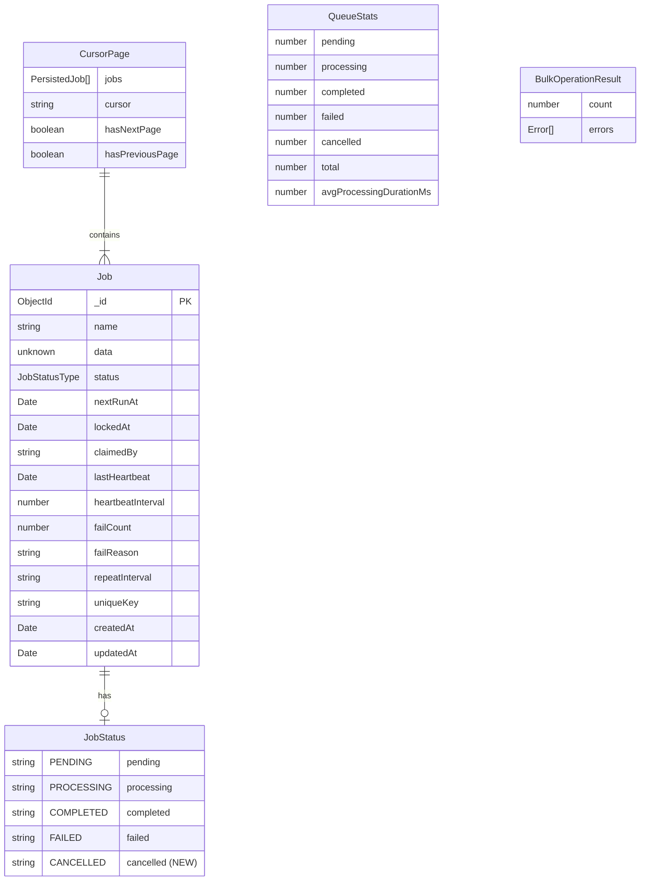
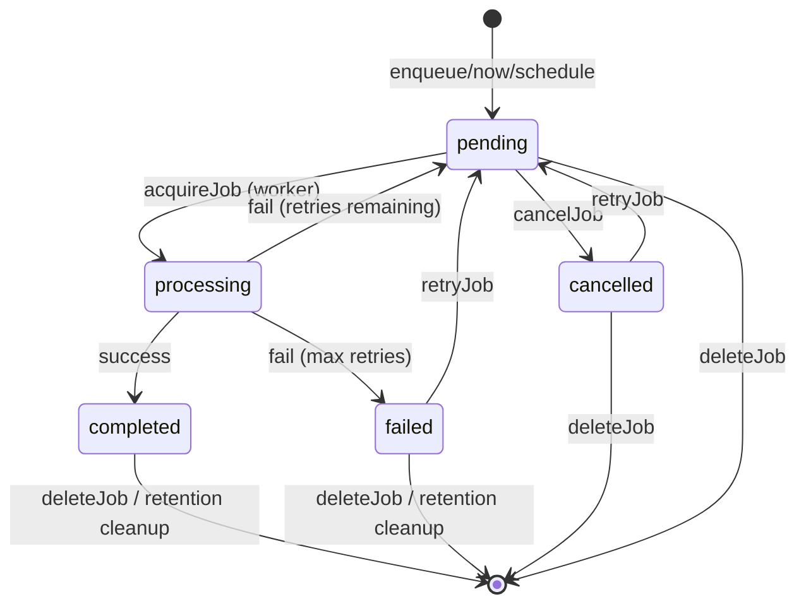

# Data Model: Management APIs

**Feature**: 002-management-apis  
**Date**: 2026-01-16

## Type Definitions

### Extended Job Status

The existing `JobStatus` const object is extended with a new terminal state:

```typescript
// File: packages/core/src/jobs/types.ts

export const JobStatus = {
  PENDING: 'pending',
  PROCESSING: 'processing',
  COMPLETED: 'completed',
  FAILED: 'failed',
  CANCELLED: 'cancelled', // NEW
} as const;

export type JobStatusType = (typeof JobStatus)[keyof typeof JobStatus];
// Becomes: 'pending' | 'processing' | 'completed' | 'failed' | 'cancelled'
```

### Cursor Direction

```typescript
// File: packages/core/src/jobs/types.ts

export const CursorDirection = {
  FORWARD: 'forward',
  BACKWARD: 'backward',
} as const;

export type CursorDirectionType = (typeof CursorDirection)[keyof typeof CursorDirection];
```

---

## New Interfaces

### JobSelector

Filter type for bulk operations. All fields are optional—an empty filter matches all jobs.

```typescript
// File: packages/core/src/jobs/types.ts

/**
 * Filter options for bulk operations.
 * 
 * @example
 * ```typescript
 * // Cancel all pending email jobs
 * await monque.cancelJobs({ name: 'send-email', status: 'pending' });
 * 
 * // Delete completed jobs older than 7 days
 * const weekAgo = new Date(Date.now() - 7 * 24 * 60 * 60 * 1000);
 * await monque.deleteJobs({ status: 'completed', olderThan: weekAgo });
 * ```
 */
export interface JobSelector {
  /** Filter by job type name */
  name?: string;

  /** Filter by status (single or multiple) */
  status?: JobStatusType | JobStatusType[];

  /** Filter jobs created before this date */
  olderThan?: Date;

  /** Filter jobs created after this date */
  newerThan?: Date;
}
```

### CursorOptions

Options for cursor-based pagination queries.

```typescript
// File: packages/core/src/jobs/types.ts

/**
 * Options for cursor-based pagination.
 * 
 * @example
 * ```typescript
 * // First page
 * const page1 = await monque.getJobsWithCursor({ limit: 50 });
 * 
 * // Next page using cursor
 * const page2 = await monque.getJobsWithCursor({ 
 *   cursor: page1.cursor, 
 *   limit: 50 
 * });
 * ```
 */
export interface CursorOptions {
  /** Opaque cursor from previous query */
  cursor?: string;

  /** Maximum jobs per page (default: 50) */
  limit?: number;

  /** Pagination direction (default: forward) */
  direction?: CursorDirectionType;

  /** Optional filters to apply */
  filter?: Pick<GetJobsFilter, 'name' | 'status'>;
}
```

### CursorPage

Response type for cursor-based pagination queries.

```typescript
// File: packages/core/src/jobs/types.ts

/**
 * Paginated response with cursor for stable iteration.
 * 
 * @template T - The type of the job data payload
 */
export interface CursorPage<T = unknown> {
  /** Jobs in this page */
  jobs: PersistedJob<T>[];

  /** Cursor for next/previous page, null if no more results */
  cursor: string | null;

  /** Whether more results exist in forward direction */
  hasNextPage: boolean;

  /** Whether results exist in backward direction */
  hasPreviousPage: boolean;
}
```

### QueueStats

Response type for queue statistics aggregation.

```typescript
// File: packages/core/src/jobs/types.ts

/**
 * Aggregate statistics for the job queue.
 * 
 * @example
 * ```typescript
 * const stats = await monque.getQueueStats();
 * console.log(`Pending: ${stats.pending}, Failed: ${stats.failed}`);
 * 
 * if (stats.avgProcessingDurationMs) {
 *   console.log(`Avg processing: ${stats.avgProcessingDurationMs}ms`);
 * }
 * ```
 */
export interface QueueStats {
  /** Count of pending jobs */
  pending: number;

  /** Count of processing jobs */
  processing: number;

  /** Count of completed jobs */
  completed: number;

  /** Count of failed jobs */
  failed: number;

  /** Count of cancelled jobs */
  cancelled: number;

  /** Total job count (sum of all statuses) */
  total: number;

  /** Average processing duration in milliseconds (completed jobs only) */
  avgProcessingDurationMs?: number;
}
```

### BulkOperationResult

Response type for bulk cancel and retry operations.

```typescript
// File: packages/core/src/jobs/types.ts

/**
 * Result of a bulk operation (cancel/retry).
 * 
 * @example
 * ```typescript
 * const result = await monque.cancelJobs({ name: 'email', status: 'pending' });
 * console.log(`Cancelled ${result.count} jobs`);
 * 
 * if (result.errors.length > 0) {
 *   console.error('Some jobs could not be cancelled:', result.errors);
 * }
 * ```
 */
export interface BulkOperationResult {
  /** Number of jobs successfully affected */
  count: number;

  /** Errors for jobs that could not be processed */
  errors: Array<{
    jobId: string;
    error: string;
  }>;
}
```

---

## New Error Classes

### JobStateError

Thrown when attempting an invalid state transition.

```typescript
// File: packages/core/src/shared/errors.ts

/**
 * Error thrown when a job cannot transition to the requested state.
 * 
 * @example
 * ```typescript
 * try {
 *   await monque.cancelJob(processingJobId);
 * } catch (error) {
 *   if (error instanceof JobStateError) {
 *     console.error(`Cannot ${error.attemptedAction} job in ${error.currentStatus} state`);
 *   }
 * }
 * ```
 */
export class JobStateError extends MonqueError {
  constructor(
    message: string,
    public readonly jobId: string,
    public readonly currentStatus: string,
    public readonly attemptedAction: 'cancel' | 'retry' | 'reschedule',
  ) {
    super(message);
    this.name = 'JobStateError';
    if (Error.captureStackTrace) {
      Error.captureStackTrace(this, JobStateError);
    }
  }
}
```

### InvalidCursorError

Thrown when a cursor cannot be decoded or has expired.

```typescript
// File: packages/core/src/shared/errors.ts

/**
 * Error thrown when a pagination cursor is invalid or expired.
 * 
 * @example
 * ```typescript
 * try {
 *   await monque.getJobsWithCursor({ cursor: 'invalid' });
 * } catch (error) {
 *   if (error instanceof InvalidCursorError) {
 *     // Start pagination from beginning
 *     await monque.getJobsWithCursor({ limit: 50 });
 *   }
 * }
 * ```
 */
export class InvalidCursorError extends MonqueError {
  constructor(message: string) {
    super(message);
    this.name = 'InvalidCursorError';
    if (Error.captureStackTrace) {
      Error.captureStackTrace(this, InvalidCursorError);
    }
  }
}
```

---

## New Events

### job:cancelled

Emitted when a single job is cancelled via `cancelJob()`.

```typescript
// File: packages/core/src/events/types.ts

export interface MonqueEventMap {
  // ... existing events ...

  /**
   * Emitted when a job is cancelled.
   */
  'job:cancelled': {
    job: Job;
  };
}
```

### job:retried

Emitted when a single job is retried via `retryJob()`.

```typescript
// File: packages/core/src/events/types.ts

export interface MonqueEventMap {
  // ... existing events ...

  /**
   * Emitted when a job is manually retried.
   */
  'job:retried': {
    job: Job;
    /** The status before retry ('failed' or 'cancelled') */
    previousStatus: 'failed' | 'cancelled';
  };
}
```

---

## Entity Relationships



---

## State Transitions



**Notes:**
- `processing` jobs cannot be cancelled (returns error)
- `completed` jobs cannot be cancelled or retried (throws error)
- All jobs can be deleted regardless of status
