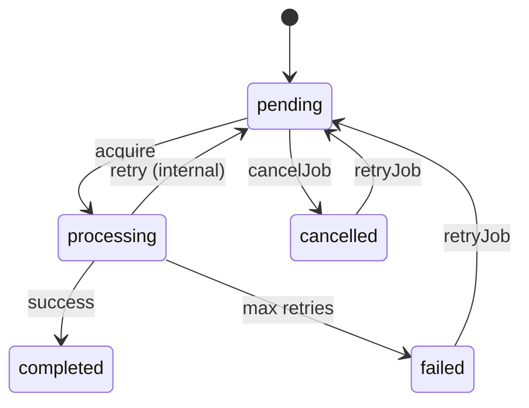

# Research: Management APIs

**Feature**: 002-management-apis  
**Date**: 2026-01-16

## Technical Decisions

### 1. Cursor Encoding Strategy

**Decision**: Base64-encoded ObjectId string

**Rationale**:
- ObjectId provides a stable, monotonic sort key (embedded timestamp + counter)
- Base64 is URL-safe and compact
- No external libraries required—Node.js `Buffer.from().toString('base64')` suffices

**Alternatives considered**:
- **JWT tokens**: Overhead of signing/verification unnecessary for simple pagination
- **Offset-based pagination**: Breaks under concurrent writes (missing/duplicate records)
- **Complex cursor with multiple fields**: Over-engineered for current requirements

**Implementation**:
```typescript
private encodeCursor(id: ObjectId): string {
  return Buffer.from(id.toHexString()).toString('base64url');
}

private decodeCursor(cursor: string): ObjectId {
  const hex = Buffer.from(cursor, 'base64url').toString('utf8');
  return new ObjectId(hex);
}
```

---

### 2. Bulk Operation Strategy

**Decision**: Use MongoDB `updateMany()` for cancel/retry, `deleteMany()` for delete

**Rationale**:
- Native MongoDB operations are atomic per document
- Best-effort execution: collect errors but continue processing
- No artificial limits on batch size per spec clarification

**Alternatives considered**:
- **Individual findOneAndUpdate in loop**: More events emitted, but O(n) roundtrips
- **Aggregation + bulk write**: More complex, no clear benefit

**Trade-off**: Using `updateMany()` means we cannot emit individual `job:cancelled` events for each affected job. This is acceptable because:
1. Performance: Emitting 1000 events would be expensive
2. Bulk operations return count of affected jobs
3. Applications can query updated jobs if needed

---

### 3. Statistics Aggregation

**Decision**: MongoDB aggregation pipeline with `$facet`

**Rationale**:
- Single query gets all status counts
- `$facet` allows parallel aggregation stages
- Processing duration calculated from `createdAt` → `updatedAt` for completed jobs

**Performance consideration**:
- Index on `{ status: 1 }` already exists for polling
- For name-filtered stats, index `{ name: 1, status: 1 }` may help—evaluate in testing
- 100K jobs should complete in <5s per spec requirement

**Implementation sketch**:
```typescript
const pipeline = [
  { $match: nameFilter },
  {
    $facet: {
      statusCounts: [
        { $group: { _id: '$status', count: { $sum: 1 } } }
      ],
      avgDuration: [
        { $match: { status: 'completed' } },
        {
          $project: {
            duration: { $subtract: ['$updatedAt', '$createdAt'] }
          }
        },
        { $group: { _id: null, avg: { $avg: '$duration' } } }
      ]
    }
  }
];
```

---

### 4. State Transition Validation

**Decision**: Validate state in MongoDB query filter, not application code

**Rationale**:
- Atomic: Prevents race conditions where job state changes between read and update
- Single roundtrip: No need for separate read to check state
- Consistent with existing `acquireJob()` pattern

**cancelJob conditions**:
- Job must be in `pending` or `failed` status (not `processing`, `completed`, `cancelled`)
- Use `findOneAndUpdate` with `{ _id: id, status: { $in: ['pending', 'failed'] } }`
- Returns null if job not found or in wrong state

**retryJob conditions**:
- Job must be in `failed` or `cancelled` status
- Resets `failCount` to 0, clears `failReason`
- Sets `nextRunAt` to now

---

### 5. External Library Assessment

**Decision**: No additional libraries needed

**Evaluated libraries**:

| Library | Purpose | Verdict |
|---------|---------|---------|
| `es-toolkit` | Utility functions | ❌ Not needed—no complex data transformations |
| `type-fest` | Type utilities | ❌ Not needed—standard TypeScript suffices |
| `superjson` | Cursor serialization | ❌ Base64 ObjectId is simpler |
| `zod` | Runtime validation | ❌ Out of scope—core doesn't validate user input |

**Rationale**: The APIs are straightforward CRUD operations with simple type transformations. Adding dependencies increases bundle size and maintenance burden without proportional benefit.

---

### 6. Cancelled Status Semantics

**Decision**: `cancelled` is a terminal state (like `completed` and `failed`)

**Rationale**:
- Jobs explicitly cancelled by operators should not auto-retry
- Cancelled jobs can be explicitly retried via `retryJob()` if desired
- Consistent with spec: "retryJob transitions from failed or cancelled to pending"

**State diagram update**:


---

### 7. Event Emission for Bulk Operations

**Decision**: No individual events for bulk operations

**Rationale**:
- Bulk operations are administrative/cleanup actions
- Emitting 1000+ events would be expensive and noisy
- Return value includes count and errors for observability
- Applications needing per-job tracking should use single-job methods

---

### 8. Filter-to-Query Translation

**Decision**: Private helper method `buildSelectorQuery(filter: JobSelector): Filter<Document>`

**Mapping**:
```typescript
private buildSelectorQuery(filter: JobSelector): Filter<Document> {
  const query: Filter<Document> = {};
  
  if (filter.name) {
    query.name = filter.name;
  }
  
  if (filter.status) {
    query.status = Array.isArray(filter.status) 
      ? { $in: filter.status } 
      : filter.status;
  }
  
  if (filter.olderThan || filter.newerThan) {
    query.createdAt = {};
    if (filter.olderThan) query.createdAt.$lt = filter.olderThan;
    if (filter.newerThan) query.createdAt.$gt = filter.newerThan;
  }
  
  return query;
}
```

---

### 9. Reschedule Job Semantics

**Decision**: Add `rescheduleJob(id, runAt)` for delaying/advancing pending jobs

**Rationale**:
- Common use case: "delay this job by 1 hour" or "run this job now instead of later"
- Only valid for `pending` status jobs (not processing, completed, failed, cancelled)
- Uses `findOneAndUpdate` with state validation like other single-job methods

**Implementation**:
```typescript
async rescheduleJob(id: ObjectId, runAt: Date): Promise<PersistedJob | null> {
  return this.collection.findOneAndUpdate(
    { _id: id, status: JobStatus.PENDING },
    { $set: { nextRunAt: runAt, updatedAt: new Date() } },
    { returnDocument: 'after' }
  );
}
```

---

### 10. Cursor Expiration Policy

**Decision**: Cursors never expire (stateless ObjectId-based)

**Rationale**:
- ObjectId cursors are stateless—they encode only a position, not session state
- No server-side cursor storage needed
- Cursor remains valid as long as the referenced job exists
- If job is deleted, pagination continues from next valid position

**Trade-off**: A cursor pointing to a deleted job will skip that position silently. This is acceptable because:
1. Pagination is eventually consistent anyway
2. Alternative (time-based expiry) adds complexity without clear benefit
3. Applications can re-query if needed

---

### 11. Statistics Index Strategy

**Decision**: Evaluate compound index `{ name: 1, status: 1 }` during testing

**Rationale**:
- Existing `{ status: 1, nextRunAt: 1 }` index covers unfiltered stats
- Adding index for every possible filter pattern leads to index bloat
- MongoDB can still use collection scan for name-filtered stats on <100K jobs

**Action**: Run performance tests during implementation. If filtered stats exceed 5s threshold, add the compound index. Document findings in implementation.

---

## Open Questions (Resolved)

All technical unknowns from spec clarifications have been resolved:

| Question | Resolution |
|----------|------------|
| Authorization | Out of scope—consuming app handles access control |
| Bulk partial failures | Best-effort with error collection |
| Statistics performance | Under 5s for 100K+ jobs |
| Bulk safeguards | No artificial limits |
| State lifecycle diagram | Included above |
| Bulk event emissions | No individual events—count + errors sufficient |
| Cursor expiration | None—stateless ObjectId cursors are always valid |
| Statistics index | Evaluate in testing, add if needed |
