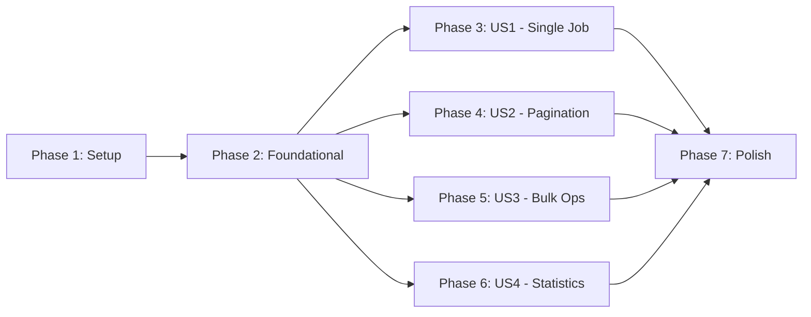

# Tasks: Management APIs

**Input**: Design documents from `/specs/002-management-apis/`  
**Prerequisites**: plan.md ✓, spec.md ✓, data-model.md ✓, research.md ✓, contracts/ ✓

## Format: `[ID] [P?] [Story?] Description`

- **[P]**: Can run in parallel (different files, no dependencies)
- **[Story]**: Which user story this task belongs to (US1, US2, US3, US4)
- All paths relative to repository root

---

## Phase 1: Setup

**Purpose**: Add foundational types and infrastructure required by all user stories

- [x] T001 [P] Add `cancelled` to `JobStatus` const in `packages/core/src/jobs/types.ts`
- [x] T002 [P] Add `CursorDirection` const and type in `packages/core/src/jobs/types.ts`
- [x] T003 [P] Add `JobSelector` interface in `packages/core/src/jobs/types.ts`
- [x] T004 [P] Add `CursorOptions` interface in `packages/core/src/jobs/types.ts`
- [x] T005 [P] Add `CursorPage<T>` interface in `packages/core/src/jobs/types.ts`
- [x] T006 [P] Add `QueueStats` interface in `packages/core/src/jobs/types.ts`
- [x] T007 [P] Add `BulkOperationResult` interface in `packages/core/src/jobs/types.ts`

**Checkpoint**: All new types defined—implementation phases can begin

---

## Phase 2: Foundational (Blocking Prerequisites)

**Purpose**: Core infrastructure that MUST be complete before ANY user story implementation

### Implementation

- [x] T008 [P] Add `isCancelledJob<T>()` type guard in `packages/core/src/jobs/guards.ts`
- [x] T009 [P] Add `job:cancelled` event to `MonqueEventMap` in `packages/core/src/events/types.ts`
- [x] T010 [P] Add `job:retried` event to `MonqueEventMap` in `packages/core/src/events/types.ts`
- [x] T010a [P] Add `job:deleted` event to `MonqueEventMap` in `packages/core/src/events/types.ts`
- [x] T011 [P] Add `JobStateError` class in `packages/core/src/shared/errors.ts`
- [x] T012 [P] Add `InvalidCursorError` class in `packages/core/src/shared/errors.ts`
- [x] T013 Add private `buildSelectorQuery()` helper in `packages/core/src/scheduler/helpers.ts`
- [x] T014 Add private `encodeCursor()` helper in `packages/core/src/scheduler/helpers.ts`
- [x] T015 Add private `decodeCursor()` helper in `packages/core/src/scheduler/helpers.ts`
- [x] T016 Export new types and errors from `packages/core/src/index.ts`

### Unit Tests (Pure Logic – No DB Required)

- [x] T017 [P] Add unit tests for `isCancelledJob()` guard in `packages/core/tests/unit/guards.test.ts`
- [x] T018 [P] Add unit tests for `JobStateError` class in `packages/core/tests/unit/errors.test.ts`
- [x] T019 [P] Add unit tests for `InvalidCursorError` class in `packages/core/tests/unit/errors.test.ts`
- [x] T020 [P] Create `packages/core/tests/unit/cursor.test.ts` for cursor encoding tests
- [x] T021 [P] Add unit test: `encodeCursor()` produces valid base64url string
- [x] T022 [P] Add unit test: `decodeCursor()` returns correct ObjectId
- [x] T023 [P] Add unit test: `decodeCursor()` with invalid input throws `InvalidCursorError`
- [x] T024 [P] Create `packages/core/tests/unit/selector.test.ts` for filter query tests
- [x] T025 [P] Add unit test: `buildSelectorQuery()` with empty filter returns empty object
- [x] T026 [P] Add unit test: `buildSelectorQuery()` with name filter
- [x] T027 [P] Add unit test: `buildSelectorQuery()` with single status filter
- [x] T028 [P] Add unit test: `buildSelectorQuery()` with status array uses `$in`
- [x] T029 [P] Add unit test: `buildSelectorQuery()` with olderThan/newerThan uses `$lt`/`$gt`

**Checkpoint**: Foundation ready—user story implementation can now begin

---

## Phase 3: User Story 1 – Single Job Management (Priority: P1) 🎯 MVP

**Goal**: Enable operators to manage individual jobs: cancel, retry, reschedule, delete

**Independent Test**: Create jobs in various states, call management methods, verify state transitions and event emissions

### Integration Tests for User Story 1

- [x] T030 [P] [US1] Create integration test file `packages/core/tests/integration/management.test.ts`
- [x] T031 [US1] Add test: `cancelJob()` on pending job → status becomes cancelled, event emitted
- [x] T032 [US1] Add test: `cancelJob()` on processing job → throws JobStateError
- [x] T033 [US1] Add test: `cancelJob()` on already cancelled job → idempotent success
- [x] T034 [US1] Add test: `cancelJob()` on non-existent job → returns null
- [x] T035 [US1] Add test: `retryJob()` on failed job → status becomes pending, failCount resets
- [x] T036 [US1] Add test: `retryJob()` on cancelled job → status becomes pending
- [x] T037 [US1] Add test: `retryJob()` on pending/processing job → throws JobStateError
- [x] T038 [US1] Add test: `rescheduleJob()` on pending job → nextRunAt updated
- [x] T039 [US1] Add test: `rescheduleJob()` on non-pending job → throws JobStateError
- [x] T040 [US1] Add test: `deleteJob()` on any job → returns true
- [x] T041 [US1] Add test: `deleteJob()` on non-existent job → returns false
- [x] T041a [US1] Add test: `deleteJob()` on recurring job → removes job and verifies no special recurrence handling

### Implementation for User Story 1

- [x] T042 [US1] Implement `cancelJob(id)` method in `packages/core/src/scheduler/monque.ts`
- [x] T043 [US1] Implement `retryJob(id)` method in `packages/core/src/scheduler/monque.ts`
- [x] T044 [US1] Implement `rescheduleJob(id, runAt)` method in `packages/core/src/scheduler/monque.ts`
- [x] T045 [US1] Implement `deleteJob(id)` method in `packages/core/src/scheduler/monque.ts`
- [x] T046 [US1] Export single-job methods from `packages/core/src/index.ts`
- [x] T047 [US1] Run integration tests and verify all pass
- [x] T047a [US1] Add observability test: verify all management operations emit expected events with correct payloads
- [x] T047b [US1] Add explicit event tests in `packages/core/tests/integration/events.test.ts` for cancelled, retried, and deleted events

**Checkpoint**: Single job management functional and tested—MVP complete

---

## Phase 4: User Story 2 – Cursor-Based Pagination (Priority: P2)

**Goal**: Enable stable pagination through large job lists without missing or duplicating records

**Independent Test**: Insert jobs, paginate with cursors, add/remove jobs mid-pagination, verify no records missed or duplicated

### Integration Tests for User Story 2

- [x] T048 [P] [US2] Create integration test file `packages/core/tests/integration/cursor-pagination.test.ts`
- [x] T049 [US2] Add test: First page returns jobs + cursor + hasNextPage
- [x] T050 [US2] Add test: Subsequent pages with cursor continue correctly
- [x] T051 [US2] Add test: Forward/backward pagination works
- [x] T052 [US2] Add test: Jobs added during pagination appear correctly
- [x] T053 [US2] Add test: Jobs deleted during pagination don't break cursor
- [x] T054 [US2] Add test: Invalid cursor throws `InvalidCursorError`
- [x] T055 [US2] Add test: Large dataset (1000+ jobs) handles efficiently

### Implementation for User Story 2

- [x] T056 [US2] Implement `getJobsWithCursor<T>(options?)` method in `packages/core/src/scheduler/monque.ts`
- [x] T057 [US2] Export cursor pagination method from `packages/core/src/index.ts`
- [x] T058 [US2] Run integration tests and verify all pass

**Checkpoint**: Cursor-based pagination functional and tested

---

## Phase 5: User Story 3 – Bulk Job Management (Priority: P3)

**Goal**: Enable operators to manage multiple jobs simultaneously via filters

**Independent Test**: Create jobs matching various criteria, execute bulk operations, verify all matching jobs affected

### Integration Tests for User Story 3

- [x] T059 [P] [US3] Create integration test file `packages/core/tests/integration/bulk-management.test.ts`
- [x] T060 [US3] Add test: `cancelJobs({ name, status })` → all matching cancelled
- [x] T061 [US3] Add test: `cancelJobs()` skips processing jobs, includes in errors
- [x] T062 [US3] Add test: `retryJobs({ status: 'failed' })` → all matching become pending
- [x] T063 [US3] Add test: `deleteJobs({ status, olderThan })` → removed
- [x] T064 [US3] Add test: Empty filter matches no jobs → count 0, no errors

### Implementation for User Story 3

- [x] T065 [US3] Implement `cancelJobs(filter)` method in `packages/core/src/scheduler/monque.ts`
- [x] T066 [US3] Implement `retryJobs(filter)` method in `packages/core/src/scheduler/monque.ts`
- [x] T067 [US3] Implement `deleteJobs(filter)` method in `packages/core/src/scheduler/monque.ts`
- [x] T068 [US3] Export bulk methods from `packages/core/src/index.ts`
- [x] T069 [US3] Run integration tests and verify all pass

**Checkpoint**: Bulk job management functional and tested

---

## Phase 6: User Story 4 – Queue Statistics (Priority: P4)

**Goal**: Provide aggregate metrics for queue health monitoring

**Independent Test**: Create jobs in known states, call statistics method, verify aggregates match expected values

### Integration Tests for User Story 4

- [x] T070 [P] [US4] Create integration test file `packages/core/tests/integration/statistics.test.ts`
- [x] T071 [US4] Add test: Empty queue returns zero counts
- [x] T072 [US4] Add test: Mixed status jobs return correct counts
- [x] T073 [US4] Add test: Filter by name scopes statistics
- [x] T074 [US4] Add test: Average processing duration calculated correctly
- [x] T075 [US4] Add test: Performance test – 100K jobs returns in <5s

### Implementation for User Story 4

- [x] T076 [US4] Implement `getQueueStats(filter?)` method in `packages/core/src/scheduler/monque.ts`
- [x] T077 [US4] Export statistics method from `packages/core/src/index.ts`
- [x] T078 [US4] Run integration tests and verify all pass

**Checkpoint**: Queue statistics functional and tested

---

## Phase 7: Polish & Cross-Cutting Concerns

**Purpose**: Final validation and documentation

- [ ] T079 [P] Run full integration test suite: `cd packages/core && bun run test:integration`
- [ ] T080 [P] Run unit tests: `cd packages/core && bun run test:unit`
- [ ] T081 [P] Run type-check: `cd packages/core && bun run type-check`
- [ ] T082 [P] Run check:exports: `cd packages/core && bun run check:exports`
- [ ] T083 Run full test suite with coverage: `bun run test:coverage`
- [ ] T084 Validate quickstart.md examples compile and work
- [ ] T085 Update `apps/docs` with all new documentation based on new APIs
- [ ] T086 Update all `README.md` as needed
- [ ] T087 Update all documentation as needed
- [ ] T088 Create changeset for v1.1.0 release

---

## Dependencies & Execution Order

### Phase Dependencies



### User Story Dependencies

| Story | Depends On | Can Start After |
|-------|------------|-----------------|
| US1 (Single Job) | Foundational | Phase 2 complete |
| US2 (Pagination) | Foundational | Phase 2 complete |
| US3 (Bulk Ops) | Foundational | Phase 2 complete |
| US4 (Statistics) | Foundational | Phase 2 complete |

> [!NOTE]
> User Stories 1-4 are **independent** and can run in parallel after Phase 2 completes.

### Parallel Opportunities

**Phase 1 (all parallel):**
```
T001, T002, T003, T004, T005, T006, T007
```

**Phase 2 Implementation (grouped parallel):**
```
T008, T009, T010, T011, T012 (all parallel – different files)
T013, T014, T015 (sequential – same file)
```

**Phase 2 Unit Tests (all parallel):**
```
T017, T018, T019 (existing test files)
T020-T023 (new cursor.test.ts)
T024-T029 (new selector.test.ts)
```

**User Story Test Files (parallel):**
```
T030, T048, T059, T070 (all different files)
```

---

## Test Strategy

### Unit Tests (Pure Logic)

| Component | Test File | What's Tested |
|-----------|-----------|---------------|
| `isCancelledJob()` | `guards.test.ts` | Type guard returns correct boolean |
| `JobStateError` | `errors.test.ts` | Error construction, properties |
| `InvalidCursorError` | `errors.test.ts` | Error construction, properties |
| `encodeCursor()` | `cursor.test.ts` | Base64url encoding |
| `decodeCursor()` | `cursor.test.ts` | Base64url decoding, error on invalid |
| `buildSelectorQuery()` | `selector.test.ts` | Filter → MongoDB query transformation |

### Integration Tests (Require MongoDB)

| Feature | Test File | What's Tested |
|---------|-----------|---------------|
| Single Job Ops | `management.test.ts` | State transitions, events, null handling |
| Pagination | `cursor-pagination.test.ts` | Cursor stability, direction, concurrent mods |
| Bulk Ops | `bulk-management.test.ts` | Filter matching, error collection |
| Statistics | `statistics.test.ts` | Aggregation accuracy, performance |

---

## Implementation Strategy

### MVP First (User Story 1 Only)

1. Complete Phase 1: Setup (types)
2. Complete Phase 2: Foundational (guards, events, errors, helpers + unit tests)
3. Complete Phase 3: User Story 1 (single job management)
4. **STOP and VALIDATE**: Run `bun run test:integration -- management`
5. Deploy/demo if ready

### Incremental Delivery

1. Setup + Foundational → Foundation ready
2. Add US1 (Single Job) → Test → **MVP Release**
3. Add US2 (Pagination) → Test → Iterate
4. Add US3 (Bulk Ops) → Test → Iterate
5. Add US4 (Statistics) → Test → **Full Feature Complete**

---

## Summary

| Metric | Count |
|--------|-------|
| **Total Tasks** | 89 |
| **Phase 1 (Setup)** | 7 |
| **Phase 2 (Foundational)** | 23 (9 impl + 14 unit tests) |
| **US1 (Single Job)** | 20 |
| **US2 (Pagination)** | 11 |
| **US3 (Bulk Ops)** | 11 |
| **US4 (Statistics)** | 9 |
| **Phase 7 (Polish)** | 8 |
| **Unit Test Tasks** | 13 |
| **Integration Test Tasks** | 31 |
| **Parallel Opportunities** | 35 tasks marked [P] |
| **MVP Scope** | Phases 1-3 (50 tasks) |
